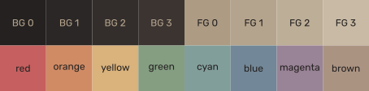
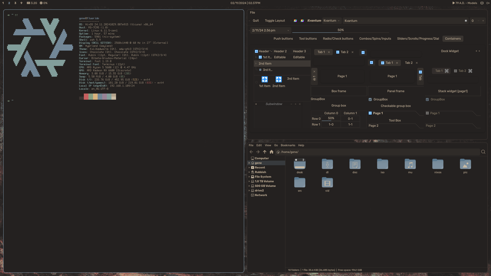
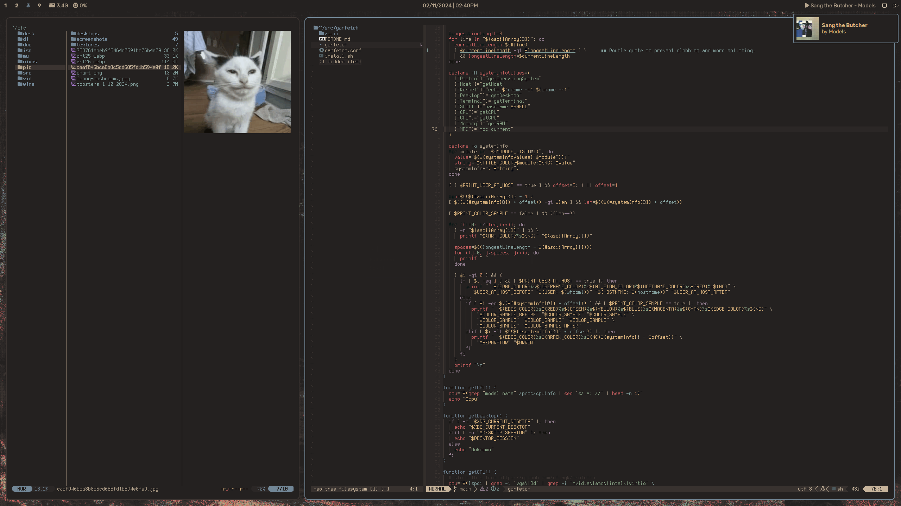
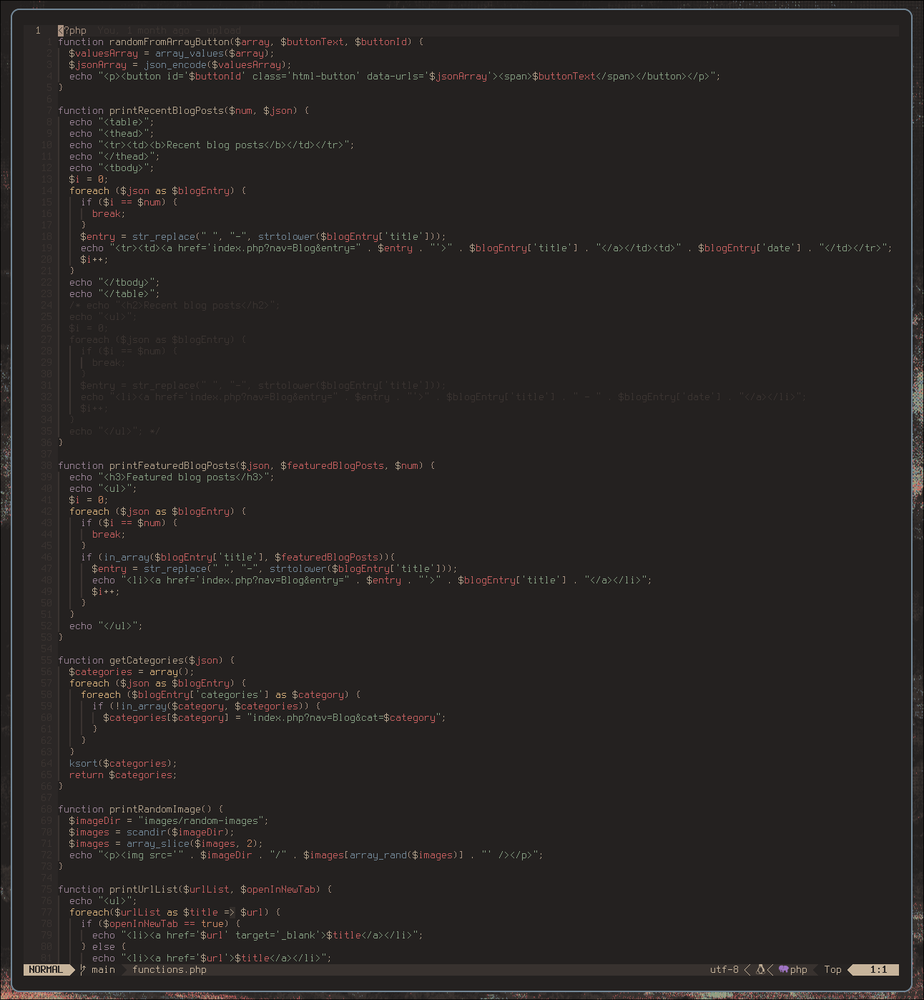

# Carob Theme
        
     
A theme based on the [Chocolate](https://gitlab.com/snakedye/chocolate) colorscheme.
     
| Base16 | HEX     |
| :----- | :-----: |
| BG 0   | #242120 |
| BG 1   | #2b2726 |
| BG 2   | #332e2b |
| BG 3   | #3b3431 |
| FG 0   | #ad9b84 |
| FG 1   | #b5a48d |
| FG 2   | #bdae97 |
| FG 3   | #c8baa4 |
| red    | #c65f5f |
| orange | #d08b65 |
| yellow | #d9b27c |
| green  | #859e82 |
| cyan   | #829e9b |
| blue   | #728797 |
| purple | #998396 |
| brown  | #ab9382 |
     
## Currently Supports
- Base16
- btop
- Discord
- Foot
- GTK2/3/4 (limited DE support -- based on [adw-gtk3](https://github.com/lassekongo83/adw-gtk3))
- GTK icons
- Qt/Kvantum
- Mako
- Rofi
- Yazi

## Example Screenshots
    
     
    
